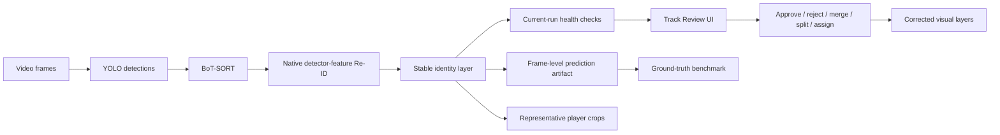

# Tracking Quality Gate

The Tracking Quality Gate sits after BoT-SORT and the stable identity layer in `Match Analysis +`. It does not claim perfect identity from a single camera. It makes identity quality measurable, exposes difficult cases, and stores analyst corrections without overwriting the original run artifacts.

## Runtime Pipeline



Each new analysis run records:

- the active tracker class and Ultralytics version;
- whether Re-ID was requested and active;
- per-frame stable-ID bounding boxes in `tracking-quality/predictions.json`;
- representative crops for every confirmed track;
- identity, appearance/Re-ID, motion, and team consistency scores;
- fragment count, raw-ID transitions, risk level, and review issues;
- original and corrected visual-layer objects.

## Two Different Metric Groups

### Current-run health

These values are available without labels:

- identity confidence;
- appearance/Re-ID consistency;
- motion consistency;
- team-color consistency;
- suspected switch risk;
- observed track fragments.

They are quality-control signals, not benchmark claims.

### Ground-truth benchmark

These values are only populated after uploading frame-level ground truth:

- exact ID switches;
- IDF1;
- HOTA across IoU thresholds `0.05` through `0.95`;
- fragmentation;
- IDTP, IDFP, and IDFN.

Until ground truth is present, the API deliberately returns `ground_truth_required` and null benchmark values.

## Ground-truth JSON

The benchmark accepts either grouped frames or a flat observation list.

### Grouped frames

```json
{
  "frames": [
    {
      "frame": 0,
      "objects": [
        {
          "identity_id": "player-10",
          "bbox": [758.4, 309.6, 828.8, 439.2]
        }
      ]
    }
  ]
}
```

### Flat observations

```json
{
  "observations": [
    {
      "frame": 0,
      "identity_id": "player-10",
      "bbox_xyxy": [758.4, 309.6, 828.8, 439.2]
    }
  ]
}
```

Bounding boxes use source-video pixel coordinates in `x1, y1, x2, y2` order. Identity values may be strings or numbers, but must remain stable for the same player across frames.

## Review Actions

| Action | Result |
| --- | --- |
| Approve | Marks the identity as analyst-approved. |
| Reject | Removes the track from corrected visual layers. |
| Merge | Combines source paths into a target canonical track. |
| Split | Creates a new track at the selected frame. |
| Assign player | Links the stable track to a roster player. |
| Change team | Corrects team classification to Team 1 or Team 2. |
| Undo | Restores the saved pre-correction state. |
| Recalculate | Rebuilds `visual_layers.corrected.json` from active corrections. |

Corrections are append-only audit records. The original `visual_layers.json` remains unchanged, so a run can always be restored and recalculated.

## API

```text
GET  /match-analysis-plus/{match_id}/runs/{run_id}/quality
POST /match-analysis-plus/{match_id}/runs/{run_id}/quality/corrections
POST /match-analysis-plus/{match_id}/runs/{run_id}/quality/corrections/{correction_id}/undo
POST /match-analysis-plus/{match_id}/runs/{run_id}/quality/recalculate
POST /match-analysis-plus/{match_id}/runs/{run_id}/quality/benchmark
```

## Accuracy Boundary

BoT-SORT, native Re-ID features, appearance galleries, kit-color isolation, foot-point motion, depth proxies, global assignment, and occlusion guards reduce identity switches. A single broadcast camera can still lose identity through long occlusion, hard cuts, similar kits, poor resolution, or players leaving and re-entering the scene. The quality gate is designed so those cases are measured and corrected instead of silently treated as perfect output.
