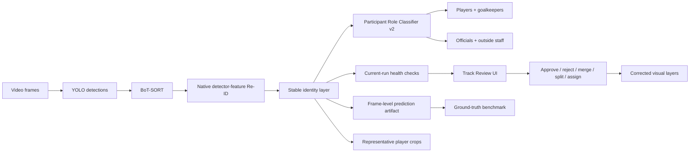

# Tracking Quality Gate

The Tracking Quality Gate sits after BoT-SORT and the stable identity layer in `Match Analysis +`. It does not claim perfect identity from a single camera. It makes identity quality measurable, exposes difficult cases, and stores analyst corrections without overwriting the original run artifacts.

## Runtime Pipeline


```mermaid
flowchart LR
    Frames["Video frames"] --> YOLO["YOLO detections"]
    YOLO --> BoTSORT["BoT-SORT"]
    BoTSORT --> ReID["Native detector-feature Re-ID"]
    ReID --> Stable["Stable identity layer"]
    Stable --> Roles["Participant Role Classifier v2"]
    Roles --> Athletes["Players + goalkeepers"]
    Roles --> NonAthletes["Officials + outside staff"]
    Stable --> Health["Current-run health checks"]
    Stable --> Predictions["Frame-level prediction artifact"]
    Stable --> Crops["Representative player crops"]
    Health --> Review["Track Review UI"]
    Review --> Corrections["Approve / reject / merge / split / assign"]
    Corrections --> Corrected["Corrected visual layers"]
    Predictions --> Benchmark["Ground-truth benchmark"]
```

Each new analysis run records:

- the active tracker class and Ultralytics version;
- whether Re-ID was requested and active;
- per-frame stable-ID bounding boxes in `tracking-quality/predictions.json`;
- representative crops for every confirmed track;
- identity, appearance/Re-ID, motion, and team consistency scores;
- fragment count, raw-ID transitions, risk level, and review issues;
- original and corrected visual-layer objects.
- temporally locked participant role, confidence, and evidence.

## Two Different Metric Groups

### Current-run health

These values are available without labels:

- identity confidence;
- appearance/Re-ID consistency;
- motion consistency;
- team-color consistency;
- suspected switch risk;
- observed track fragments.

They are quality-control signals, not benchmark claims.

### Ground-truth benchmark

These values are only populated after uploading frame-level ground truth:

- exact ID switches;
- IDF1;
- HOTA across IoU thresholds `0.05` through `0.95`;
- fragmentation;
- IDTP, IDFP, and IDFN.
- per-clip metrics and cross-team identity reuse.

The release decision additionally requires zero switches in critical clips,
`IDF1 >= 95`, `HOTA >= 90`, zero cross-team identity transfers, reviewed
fragments, crossing/crowding/re-entry coverage, and both tactical and
close-or-moving camera coverage.

Until verified ground truth is present, the API deliberately returns `ground_truth_required` and null benchmark values. Draft or automatically generated labels are rejected.

## Ground-truth JSON

The benchmark accepts either grouped frames or a flat observation list.

### Grouped frames

```json
{
  "verification": {
    "status": "verified",
    "annotator": "analyst@example.com",
    "reviewed_at": "2026-08-23T12:00:00Z"
  },
  "frames": [
    {
      "frame": 0,
      "objects": [
        {
          "identity_id": "player-10",
          "bbox": [758.4, 309.6, 828.8, 439.2],
          "team": 1,
          "role_name": "player",
          "review_state": "verified"
        }
      ]
    }
  ]
}
```

### Flat observations

```json
{
  "verification": {
    "status": "verified",
    "annotator": "analyst@example.com"
  },
  "observations": [
    {
      "frame": 0,
      "identity_id": "player-10",
      "bbox_xyxy": [758.4, 309.6, 828.8, 439.2]
    }
  ]
}
```

Bounding boxes use source-video pixel coordinates in `x1, y1, x2, y2` order. Identity values may be strings or numbers, but must remain stable for the same player across frames. Drafts also retain `source_frame` and clip-level `source_start_frame` / `source_end_frame` values, so a label created from an offset run remains aligned with the original video and future reruns.

The Quality Overview can generate a draft for a selected frame range. Every box and identity must be reviewed before changing the verification status to `verified`. Evaluation is restricted to annotated frames, so predictions outside a selected clip do not reduce its score.

## Review Actions

| Action | Result |
| --- | --- |
| Approve | Marks the identity as analyst-approved. |
| Reject | Removes the track from corrected visual layers. |
| Merge | Combines source paths into a target canonical track. |
| Split | Creates a new track at the selected frame. |
| Assign player | Links the stable track to a roster player. |
| Change team | Corrects team classification to Team 1 or Team 2. |
| Change role | Locks Player, Goalkeeper, Referee, Assistant Referee, or Staff/outside pitch after analyst review. |
| Undo | Restores the saved pre-correction state. |
| Recalculate | Rebuilds `visual_layers.corrected.json` from active corrections. |

Corrections are append-only audit records. The original `visual_layers.json` remains unchanged, so a run can always be restored and recalculated.

## API

```text
GET  /match-analysis-plus/{match_id}/runs/{run_id}/quality
POST /match-analysis-plus/{match_id}/runs/{run_id}/quality/corrections
POST /match-analysis-plus/{match_id}/runs/{run_id}/quality/corrections/{correction_id}/undo
POST /match-analysis-plus/{match_id}/runs/{run_id}/quality/recalculate
POST /match-analysis-plus/{match_id}/runs/{run_id}/quality/ground-truth/draft
POST /match-analysis-plus/{match_id}/runs/{run_id}/quality/benchmark
POST /match-analysis-plus/{match_id}/quality/release-gate/plan
POST /match-analysis-plus/quality/release-gate/suite
```

The plan endpoint divides the source video into 500-1000 frame windows without
starting a large batch accidentally. The suite endpoint combines verified cases
from different matches/runs so tactical and close/moving cameras can be judged
under one release decision.

## Participant Role Classifier v2

Role classification runs after stable identity association, so a temporary
class error cannot change a Track ID. It combines detector role history, metric
pitch geometry, touchline/goal-area history, playing-surface support, and team
kit affinity. A role is locked only after temporal agreement. Players and
goalkeepers feed possession, distance, speed, heatmaps, and radar analytics;
referees, assistant referees, and staff/outside-pitch tracks remain reviewable
but are excluded from player analytics.

The latest 500-frame mid-match tactical regression rejected 308 outside-pitch
person observations before stable identity assignment. Its final stable-role
summary was 28 players, one goalkeeper, one referee, and one assistant referee;
28 of 31 roles locked automatically, three short or ambiguous tracks remained
explicitly queued for review, and 62 attempted post-lock role changes were
prevented. Those figures are runtime evidence for that clip, not a universal
classification accuracy claim.

## Accuracy Boundary

BoT-SORT, native Re-ID features, appearance galleries, kit-color isolation, foot-point motion, depth proxies, global assignment, and occlusion guards reduce identity switches. A single broadcast camera can still lose identity through long occlusion, hard cuts, similar kits, poor resolution, or players leaving and re-entering the scene. The quality gate is designed so those cases are measured and corrected instead of silently treated as perfect output.
